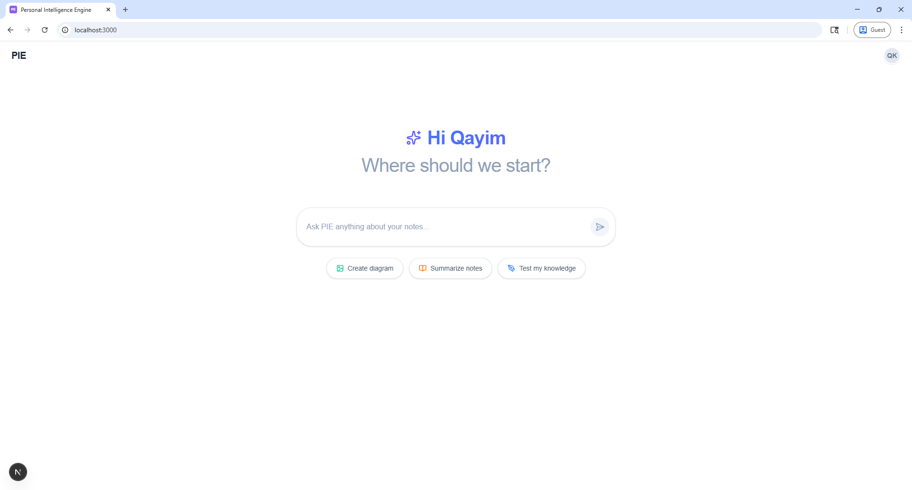
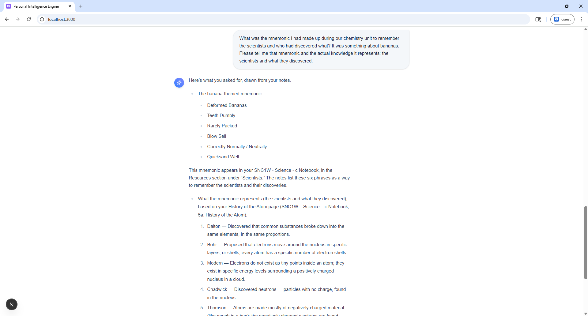
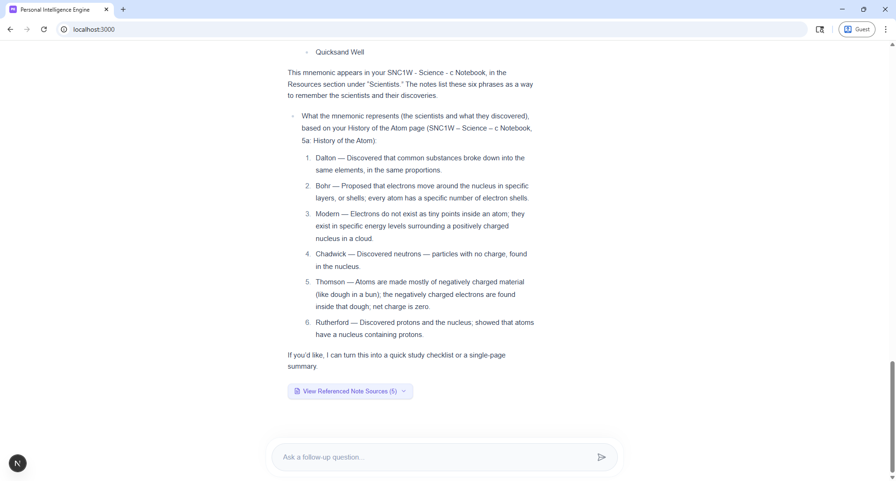
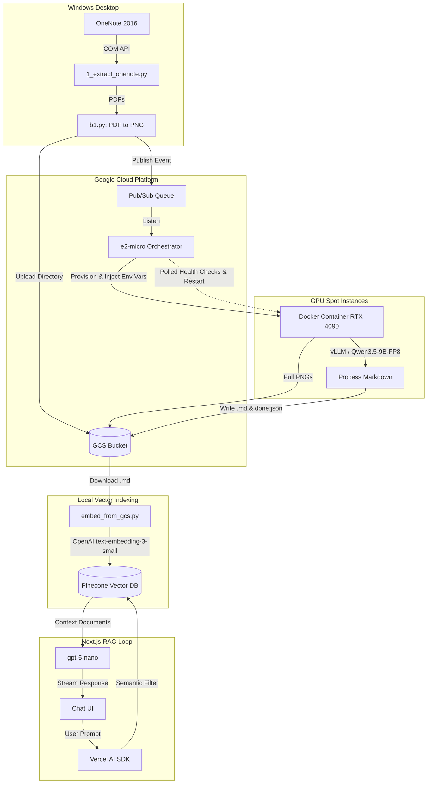

# Personal Intelligence Engine (PIE)


**A distributed local-to-cloud RAG pipeline that extracts handwritten OneNote notebooks, orchestrates GPU-accelerated OCR via pre-built Docker containers on spot instances, and serves vector-embedded notes to an AI chat interface.**





## Features & Architecture

- **COM-Bound Local Extraction:** Microsoft Graph API fails to OCR Apple Pencil ink or raw drawing layers. To bypass this, the pipeline uses the Windows COM API against the OneNote 2016 desktop client to programmatically export individual pages as high-fidelity PDFs, which are subsequently rasterized into PNGs and pushed to Google Cloud Storage (GCS).
- **Spot Instance Orchestration:** Uses a free-tier Google Cloud Platform `e2-micro` VM as an orchestrator. It listens to a Pub/Sub queue and dynamically provisions RunPod Community Cloud 4090 Spot Instances to execute high-throughput containerized OCR tasks.
- **Containerized Inference (Zero Cold-Start Waste):** The worker environment is baked into a custom Docker image containing PyTorch, CUDA bindings, and vLLM. The orchestrator instructs RunPod to pull this image and injects all required environment variables directly into the container's `cmd` execution payload. This completely eliminates expensive runtime setup latency (installing dependencies/model weights) during spot instance boots.
- **Fault-Tolerant Vision-Language Processing:** The containerized worker utilizes vLLM streaming to evaluate the community-quantized `lovedheart/Qwen3.5-9B-FP8` model, translating handwritten PNGs to Markdown. By deploying a pre-quantized FP8 model, the container aggressively maximizes memory efficiency and inference throughput on the allocated 4090s. It writes `.md` files to GCS sequentially. If a spot instance is preempted, the GCP orchestrator detects the termination via the RunPod API, respawns the pod, and resumes the exact state until a `done.json` marker is emitted.
- **Vector Retrieval System:** Processed Markdown is embedded locally with OpenAI's `text-embedding-3-small` and upserted to Pinecone.
- **Next.js Frontend:** A React web application utilizing Vercel's AI SDK to stream responses from `gpt-5-nano`, augmented by the Pinecone retrieval chain, with full Math/KaTeX parsing support.

## Tech Stack

- **Extraction:** Windows PowerShell COM API, Python `win32com`, `pypdfium2`
- **Orchestration:** Google Cloud Storage (GCS), GCP Pub/Sub, RunPod API
- **Cloud Worker:** Docker, PyTorch (cu126), vLLM, `lovedheart/Qwen3.5-9B-FP8`
- **Retrieval:** OpenAI API (`text-embedding-3-small`), Pinecone GRPC
- **Frontend:** Next.js (App Router), React, Tailwind CSS, Vercel AI SDK

## Scope & Limitations

This infrastructure was engineered as a targeted solution for processing personal high school exam notes.

- **Work in Progress (WIP):** This project is actively in development. Because it is highly unabstracted and constrained, components like the Next.js frontend are exclusively run via local development servers (`npm run dev`) and are not hardened for production deployment.
- **Data Structure:** It intentionally ignores the `_Content Library` section group specific to standard Class Notebooks to avoid duplicating reference material against personal student notes.
- **Single-Tenant Architecture:** It relies on strict local directories and hardcoded bucket structures for a single authorized user (`qayim.kanji@ashbury.ca`). The web application is explicitly designed for personal use, hardcoding greetings ("Hi Qayim") and personal avatars into the component tree.
- **OS Constraint:** The local extraction sequence requires physical Windows hardware with the Microsoft OneNote 2016 desktop application installed.

---

## Architecture Flow



## Local Setup

**Please reference `SETUP.md` for exhaustive instructions on securely configuring the required environment variables and API keys prior to execution.**

1.  **Extract Data Pipeline:** Dump the Windows notebook tree to PDFs based on COM API interactions:
    ```powershell
    python 1_extract_onenote.py
    ```
2.  **Stage to Cloud:** Render those PDFs to PNGs and stage them in GCS while publishing to the Pub/Sub orchestrator:
    ```powershell
    python b1.py --user-email "you@example.com"
    ```
    _(The remote GCP orchestrator takes over here, booting the RunPod Docker container. Wait until `done.json` populates in your GCS bucket.)_
3.  **Embed:** Pull the finalized `.md` cloud output, batch process the tokens with `tiktoken`, and populate your Pinecone index:
    ```powershell
    python embed_from_gcs.py
    ```
4.  **Start Server:** Boot the Next.js chat interface:
    ```powershell
    cd webapp
    npm run dev
    ```
